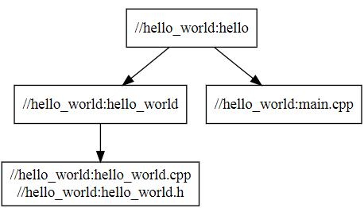
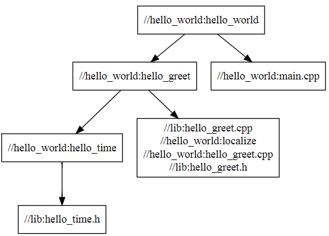

# 通用编译工具 Bazel

最近 Google 开源了它的 C++ 常用库 [Abseil](https://abseil.io/docs/cpp/quickstart)，鉴于它的文档内容都是基于 [Bazel](https://docs.bazel.build/versions/master/bazel-overview.html) 编译的，所以需要掌握一些常用的 Bazel 知识。

##   本文结构

*   [概述](#overview)
*   [安装](#install)
*   [配置](#config)
*   [Hello World](#hello_world)
*   [概念及术语](#concepts_and_terminology)
    *   [workspace](#workspace_terminology)
    *   [package](#package_terminology)
    *   [target](#target)
    *   [label](#label)
    *   [rule](#rule)
    *   [BUILD](#build)
*   [帮助](#help)
*   [配置文件](#bazelrc)
*   [构建命令](#build_command)
*   [功能函数](#functions)
    *   [load](#load)
    *   [package](#package_function)
    *   [package_group](#package_group)
    *   [licenses](#licenses)
    *   [exports_files](#exports_files)
    *   [glob](#glob)
    *   [select](#select)
    *   [workspace](#workspace_function)
*   [规则通用属性](#common_rule_attributes)
    *   [data](#data)
    *   [visibility](#visibility)
*   [通用规则](#common_rule)
    *   [filegroup](#filegroup)
    *   [config_setting](#config_setting)
    *   [genrule](#genrule)
*   [总结](#summary)

<h2 id="overview">概述</h2>

Bazel 是一个编译工具，用于构建和运行测试，它**提供了对 java,c,c++,python 的本地支持**，你还可以通过其扩展语言编译**任何语言**写的源文件。

**Bazel 支持大多数主流的运行环境(Linux,Windows,MacOs 等)和编译器**，这意味着**只要你学会了 Bazel ，就能在大多数系统下编译和测试任意语言了**，是不是很酷？:smirk:

Bazel 是没有 GUI 的，这意味着你需要知道如何为自己的工程添加编译规则(rules)。如果你用过 makefile、CMakeLists.txt 或者 QT 的 .pro 文件的话，那么 Bazel 添加编译规则的方式跟它们差不多，**Bazel 使用一个名为 BUILD 的文件来描述如何编译你的工程**。

Bazel 还有一个方便的查询语言([Query Lauguage](https://docs.bazel.build/versions/master/query.html))，通过与 [Graphviz](http://www.webgraphviz.com/) 配合使用，**可以立即构建出准确的关系依赖图**，这在管理工程时会节约不少时间。

与 cmake 一样，**如果源文件没有发生改变，Bazel 不会重新编译**。

cmake 有时会有时间戳问题、不能检测编译命令更改的问题、编译中断后再次编译输出文件不会重建的问题，虽然这些问题可以使用 touch 或 `make clean` 进行解决，但 Bazel 解决了这些问题，因此 **Bazel 比 cmake 拥有更加正确的增量构建**，你再也不必每次都执行 `clean` 后再编译了，这意味着已经编译好的文件可能不需要再次编译，这对大型工程来说，会节约相当多的时间。

**当你运行 Bazel 时，你实际上是在运行客户端(client)，客户端基于工作区路径和用户ID(userid)来寻找服务器**，所以**不同的工作区会有不同的服务器、同一个工作区的不同用户也会有不同的服务器，这意味着可以在同一个工作区并发构建**。

<h2 id="install">安装</h2>

bazel 在 Windows 下的安装非常简单，只要下载一个 Windows 安装包管理器 [Chocolatey](https://chocolatey.org/)，安装完成后以管理员身份在 cmd.exe 下执行下面这句话，然后一直按y回车就行了：

```cmd
$ choco install bazel
```

其它系统下的安装，由于没有实际操作过，可以移步 [Installing Bazel](https://docs.bazel.build/versions/master/install.html)。

<h2 id="config">配置</h2>

**所有的 Bazel 构建都发生在工作区--一个文件夹，该文件夹包含了你想编译的所有源文件和所需要的库、并且其顶层目录拥有一个名为 WORKSPACE 的文件**，这个 WORKSPACE 文件可以为空，也可以用来[引用编译所需要的外部依赖库](https://docs.bazel.build/versions/master/be/workspace.html)。

**工作区只是一个声明般的存在，真正创建编译规则的是 BUILD 文件，工作区内包含一个 BUILD 文件的文件夹被称为一个包(package)**。

**不同工作区的文件默认是相互独立的**。

构建完成后的输出文件通常不在工作区，但**会在 WORKSPACE 文件所在目录生成多个符号链接目录，这些目录指向对应输出文件所在的目录**。

<h2 id="hello_world">Hello World</h2>

我们构建一个 Hello World 来掌握一下 Bazel 的基础流程。

首先，我们构造一个这样的目录结构：

```text
bazel
├── hello_world
│   ├── BUILD
│   ├── main.cpp
│   ├── hello_world.h
│   └── hello_world.cpp
└── WORKSPACE
```

然后开始我们最喜欢的 Hello World：

```c++
// hello_world.h
#pragma once

void print_hello_world();

void print_time();
```

```c++
// hello_world.cpp
#include <ctime>
#include <string>
#include <iostream>
#include "hello_world.h"

void print_hello_world() {
	std::cout << "Hello World" << std::endl;
}

void print_time() {
	time_t t = time(0);   // get time now
	struct tm * now = localtime(&t);

	std::cout << now->tm_year + 1900 << "-"
		<< now->tm_mon + 1 << "-"
		<< now->tm_mday << " "
		<< now->tm_hour << ":"
		<< now->tm_min << ":"
		<< now->tm_sec
		<< std::endl;
}
```

```c++
// main.cpp
#include "hello_world.h"

int main()
{
    print_hello_world();
    print_time();
}
```

接着是 BUILD 文件：

```bazel
cc_library(                     # 构建库
    name = "hello_world",       # 库名
    srcs = ["hello_world.cpp"], # 源文件
    hdrs = ["hello_world.h"],   # 头文件
)

cc_binary(                      # 构建二进制文件
    name = "hello",             # 目标名
    srcs = ["main.cpp"],        # 源文件
    deps = [                    # 依赖项
        ":hello_world",         # 当前包下的 hello_world 库
    ],
)
```

最后一步，编译(git command)：

```bash
pengzhen@pengzhen-PC MINGW64 /r/bazel
$ bazel build ///hello_world:hello    # 应该是 bazel build //hello_world:hello，windows git command 需要添加一个斜杠
.............
____Loading package: hello_world
____Loading package: @bazel_tools//tools/cpp
____Loading package: @local_config_xcode//
____Loading package: @local_jdk//
____Loading package: @local_config_cc//
____Loading complete.  Analyzing...
____Found 1 target...
____Building...
____[0 / 6] BazelWorkspaceStatusAction stable-status.txt
Target //hello_world:hello up-to-date:
  C:/users/pengzhen/appdata/local/temp/_bazel_pengzhen/uhncvrpq/execroot/__main__/bazel-out/msvc_x64-fastbuild/bin/hello_world/hello.exe
____Elapsed time: 5.281s, Critical Path: 0.78s
```

根据打印的 log 可以看到生成的 EXE 文件路径。

现在我们来看看工作区发生了哪些变化：

```bash
pengzhen@pengzhen-PC MINGW64 /r/bazel
$ ll -R
.:
total 4
lrwxrwxrwx 1 pengzhen 197121 47 十月  3 11:14 bazel-bazel -> /tmp/_bazel_pengzhen/uhncvrpq/execroot/__main__/
lrwxrwxrwx 1 pengzhen 197121 80 十月  3 11:14 bazel-bin -> /tmp/_bazel_pengzhen/uhncvrpq/execroot/__main__/bazel-out/msvc_x64-fastbuild/bin/
lrwxrwxrwx 1 pengzhen 197121 85 十月  3 11:14 bazel-genfiles -> /tmp/_bazel_pengzhen/uhncvrpq/execroot/__main__/bazel-out/msvc_x64-fastbuild/genfiles/
lrwxrwxrwx 1 pengzhen 197121 57 十月  3 11:14 bazel-out -> /tmp/_bazel_pengzhen/uhncvrpq/execroot/__main__/bazel-out/
lrwxrwxrwx 1 pengzhen 197121 85 十月  3 11:14 bazel-testlogs -> /tmp/_bazel_pengzhen/uhncvrpq/execroot/__main__/bazel-out/msvc_x64-fastbuild/testlogs/
drwxr-xr-x 1 pengzhen 197121  0 十月  3 10:41 hello_world/
-rw-r--r-- 1 pengzhen 197121  0 十月  3 10:40 WORKSPACE

./hello_world:
total 4
-rw-r--r-- 1 pengzhen 197121 453 十月  3 11:06 BUILD
-rw-r--r-- 1 pengzhen 197121 444 十月  3 10:57 hello_world.cpp
-rw-r--r-- 1 pengzhen 197121  63 十月  3 10:57 hello_world.h
-rw-r--r-- 1 pengzhen 197121  89 十月  3 10:58 main.cpp
```

可以看到，hello_world 目录并没有发生任何变化，但是工作区根目录却多了5个链接目录。如果你仔细看的话，bazel-bazel,bazel-out,bazel-bin 指向同一个目录的不同层级，然后根据 bazel-genfiles,bazel-testlogs 的目录名称猜想它们应该分别是生成文件和测试log文件夹。

我们先执行一下生成的可执行文件：

```bash
pengzhen@pengzhen-PC MINGW64 /r/bazel
$ ll bazel-bin/hello_world/
total 6155
drwxr-xr-x 1 pengzhen 197121       0 十月  3 11:06 _objs/
-r-xr-xr-x 1 pengzhen 197121  787968 十月  3 11:06 hello.exe*
drwxr-xr-x 1 pengzhen 197121       0 十月  3 11:06 hello.exe.runfiles/
-r--r--r-- 1 pengzhen 197121     166 十月  3 11:06 hello.exe.runfiles_manifest
-r--r--r-- 1 pengzhen 197121     138 十月  3 11:06 hello.exe-2.params
-r--r--r-- 1 pengzhen 197121 4722688 十月  3 11:06 hello.pdb
-r--r--r-- 1 pengzhen 197121  783128 十月  3 11:06 libhello_world.a
-r--r--r-- 1 pengzhen 197121     164 十月  3 11:06 libhello_world.a-2.params

pengzhen@pengzhen-PC MINGW64 /r/bazel
$ bazel-bin/hello_world/hello.exe
Hello World
2017-10-3 11:28:15
```

结果如我们所愿，然后我们使用查询语言查看当前工程的依赖关系：

```bash
pengzhen@pengzhen-PC MINGW64 /r/bazel
$ bazel query --nohost_deps --noimplicit_deps 'deps(//hello_world:hello)' --output graph
digraph mygraph {
  node [shape=box];
"//hello_world:hello"
"//hello_world:hello" -> "//hello_world:hello_world"
"//hello_world:hello" -> "//hello_world:main.cpp"
"//hello_world:main.cpp"
"//hello_world:hello_world"
"//hello_world:hello_world" -> "//hello_world:hello_world.cpp\n//hello_world:hello_world.h"
"//hello_world:hello_world.cpp\n//hello_world:hello_world.h"
}
```

把上面生成的打印文本复制到 [Graphviz](http://www.webgraphviz.com/)，可以看到生成的依赖关系图：



<h2 id="concepts_and_terminology">概念及术语</h2>

<h3 id="workspace_terminology">workspace</h3>

前面我们说过，工作区(workspace)是一个文件夹，这个文件夹包含了你想编译的所有源文件和需要的库，并且构建后的输出文件夹也会以符号链接(symbolic link)的形式生成在工作区的根目录下。

作为工作区的标志，就是**工作区根目录下必须包含一个名为 WORKSPACE 的文件**，这个 WORKSPACE 文件可以为空，也可以被用来引用外部依赖库。

一个简单的工作区目录结构如下所示：

```text
workspace
└── WORKSPACE
```

<h3 id="package_terminology">package</h3>

**工作区的基本单元是一个包(package)**。一个包也是一个文件夹，这个文件夹一定是工作区目录的子目录(根目录也是子目录)，该文件夹包含了一系列关联的源文件，这些源文件可以以子目录的方式存在。

作为包的标志以及如何编译这些源文件，**包目录必须包含一个名为 BUILD 的文件**，为了包间的独立性，如果一个包包含了另一个包，那么**子包的文件是不属于顶层包的**。

一个简单的示例如下：

```text
bazel
├── hello_world
│   ├── BUILD
│   ├── main.cpp
│   ├── lib
│   │   ├── hello_world.h
│   │   └── hello_world.cpp
│   └── test
│       ├── BUILD
│       ├── test.h
│       └── test.cpp
└── WORKSPACE
```

这里 bazel 目录是工作区，`hello_world` 是一个包，`hello_world/test` 也是一个包，所以 test 目录不属于 `hello_world` 包，但是 `hello_world/lib` 不是一个包，所以它属于 `hello_world` 包。

**虽然你可以将工作区根目录作为一个包，但是建议用一些描述性的目录名来创建一个包**。

<h3 id="target">target</h3>

**包里面的元素被称为目标(target)**。

target 主要分为两类--文件(file)和规则(rule)，另一类不太常用的类型是 [package_group](#package_group)。

文件(file)包含两种类型--源文件与生成文件，其中生成文件是某些规则(rule)生成的文件。

**规则(rule)指定了一系列输入文件与一系列输出文件间的关系、以及一步步从这些输入文件生成这些输出文件的方式**。其中输入文件可以是源文件也可以是生成文件，但输出文件一定是生成文件，这意味着**你可以将一个规则的输出文件作为另一个规则的输入文件**。

一个规则可能包含另一个规则，**假设规则A包含规则B，那么在编译时B的头文件对于A是可用的、在链接时B的标志(symbol)对于A是可用的、在运行时B的运行时数据(runtime data)对于A是可用的**。

<h3 id="label">label</h3>

**目标(target)的名字就是一个标签(label)**。

每个标签包含两个部分--包名和目标名，例如我们在 [Hello World](#hello_world) 里面一个标签就是：

```text
//hello_world:hello
```

**其中 `hello_world` 是包名(不包含双斜杠)**，双斜杠代表从工作区根目录开始，`hello` 是目标名。

**每个标签唯一标识一个目标**。**当你省略目标名时，目标名被认为与包名的最后一部分相同**，例如下面两个标签被认为是一样的：

```text
//hello/world
//hello/world:world
```

**在 BUILD 文件中，包名是可以省略的**，例如下面四个标签都是一样的：

```text
//hello/world
//hello/world:world
:world
world
```

但是引用其他包的文件的话就不能省略包名，例如对于下面的目录结构中的 `//hello_world:BUILD` 文件，如果要引用 `hello_world/test` 的 `test.h` 文件，就必须使用 `//hello_world/test:test.h` 而不能使用 `test:test.h`，不过所幸如果你使用了错误的方式，编译时会报出错误信息。

```text
bazel
├── hello_world
│   ├── BUILD
│   ├── main.cpp
│   ├── lib
│   │   ├── hello_world.h
│   │   └── hello_world.cpp
│   └── test
│       ├── BUILD
│       ├── test.h
│       └── test.cpp
└── WORKSPACE
```

#### 标签命名规范

一个完整的标签命名公式如下：

```text
//package_name:target_name
```

其中 `package_name` 就是相对于根目录的包含 BUILD 文件的目录路径名，如 `hello_world/test`；当根目录是一个包时，`package_name` 为空，如 `//:hello`。

**包名必须由字母、数字、`/-._` 组成，但是不能以斜杠 `/` 开头和结尾**，所以不要在工作区创建中文包。

`target_name` 分为文件(file)名和规则(rule)名，其中文件名是相对于包目录的路径名，如 `lib/hello_world.h`；规则名就是 BUILD 文件中某个规则的 name 参数的值，如我们 [Hello World](#hello_world) 中就有两个规则名--`hello_world` 和 `hello`。**规则名中最好不要使用斜杠 `/`，因为可能会造成误导**。

**目标名必须由字母、数字、`_/.+-=,@~` 组成，但是不能以斜杠 `/` 开头和结尾，也不能以多个连续的斜杠 `/` 作为路径分隔符，如 `hello_world//lib`**。另外，**两个特殊的目录 `..` 和 `.` 也不能使用**。

<h3 id="rule">rule</h3>

规则(rule)指定了一系列输入文件与一系列输出文件间的关系、以及一步步从这些输入文件生成这些输出文件的方式。

例如 [Hello World](#hello_world) 中就有两个规则--`hello_world` 和 `hello`，你**可以使用 `bazel query '///hello_world:all' | sort` 列出所有的规则名**。

**规则以语言名字分组**，如 `cc_binary`,`cc_library`,`cc_test` 分别用于构建 C++ 二进制文件、库和测试，`java_*` 用于构建相应 java 模块。

**测试的程序必须是成功返回0的程序**。

<h3 id="build">BUILD</h3>

BUID 文件的语法是 [Python](http://docs.python.org/reference/lexical_analysis.html) 的一个子集，但是少了很多东西，具体少了什么东西，你可以[自行查看](https://docs.bazel.build/versions/master/build-ref.html#core_build_language)。

**BUILD 文件应该只用 ASCII 字符书写**。

**BUILD 文件中变量的顺序是无关紧要的**。

你可以使用 Python 的注释语法来为 BUILD 文件书写注释：

```python
'''
author: pengzhen
date: 2017/10/05
'''

# BUILD start
```

#### 实际依赖关系与声明依赖关系

有时候你声明的依赖关系可能与实际的依赖关系不一样，例如下面的目录结构：

```text
hello_world
├── main
│   ├── BUILD
│   └── main.cpp
├── hello_greet
│   ├── BUILD
│   └── hello_greet.h
├── hello_time
│   ├── BUILD
│   └── hello_time.h
└── WORKSPACE
```

```bazel
# main/BUILD
cc_binary(
    name = "hello",
    srcs = ["main.cpp"],
    deps = [
        "//hello_greet",
    ],
)
```

```bazel
# hello_greet/BUILD
cc_library(
    name = "hello_greet",
    hdrs = ["hello_greet.h"],
    deps = [
        "//hello_time",
    ],
    visibility = ["//main:__pkg__"],
)
```

```bazel
# hello_time/BUILD
cc_library(
    name = "hello_time",
    hdrs = ["hello_time.h"],
    visibility = [
        "//main:__pkg__",
        "//hello_greet:__pkg__"
    ],
)
```

```c++
// hello_time.h
#pragma once
#include <ctime>
#include <string>
#include <iostream>

void print_time() {
	time_t t = time(0);   // get time now
	struct tm * now = localtime(&t);

	std::cout << now->tm_year + 1900 << "-"
		<< now->tm_mon + 1 << "-"
		<< now->tm_mday << " "
		<< now->tm_hour << ":"
		<< now->tm_min << ":"
		<< now->tm_sec
		<< std::endl;
}
```

```c++
// hello_greet.h
#pragma once
#include <string>
#include <iostream>

#include "hello_time/hello_time.h"

void hello_world() {
	std::cout << "Hello World.\n";
    print_time();
}
```

通过三个 BUILD 文件可以推导出声明的依赖关系：

```text
main -> hello_greet -> hello_time
```

如果主函数如下所示的话，那么实际依赖关系与声明依赖关系一致：

```c++
// main.cpp
#include "hello_greet/hello_greet.h"

int main(){
    hello_world();
}
```

但是如果主函数是下面这样的话，那么实际依赖关系与声明依赖关系就不太一样了：

```c++
// main.cpp
#include "hello_time/hello_time.h"
#include "hello_greet/hello_greet.h"

int main(){
    hello_world();
}
```

实际依赖关系是这样的：

```text
main -> hello_greet -> hello_time
  \________________________/|
```

虽然这对结果没有太大影响，但是如果某一天 `hello_greet` 不再引用 `hello_time` 的话，就会造成编译错误：

```bazel
# hello_greet/BUILD
cc_library(
    name = "hello_greet",
    hdrs = ["hello_greet.h"],
    visibility = ["//main:__pkg__"],
)
```

```c++
// hello_greet.h
#pragma once
#include <string>
#include <iostream>

void print_hello_world() {
	std::cout << "Hello World." << std::endl;
}
```

```c++
// main.cpp
#include "hello_time/hello_time.h"
#include "hello_greet/hello_greet.h"

int main(){
    print_hello_world();
    print_time();
}
```

<h2 id="help">帮助</h2>

查看帮助可以执行 `bazel help`：

```bash
$ bazel help
                                                           [bazel release 0.5.4]
Usage: bazel <command> <options> ...

Available commands:
  analyze-profile     Analyzes build profile data.
  build               Builds the specified targets.
  canonicalize-flags  Canonicalizes a list of bazel options.
  clean               Removes output files and optionally stops the server.
  coverage            Generates code coverage report for specified test targets.
  dump                Dumps the internal state of the bazel server process.
  fetch               Fetches external repositories that are prerequisites to the targets.
  help                Prints help for commands, or the index.
  info                Displays runtime info about the bazel server.
  license             Prints the license of this software.
  mobile-install      Installs targets to mobile devices.
  query               Executes a dependency graph query.
  run                 Runs the specified target.
  shutdown            Stops the bazel server.
  test                Builds and runs the specified test targets.
  version             Prints version information for bazel.

Getting more help:
  bazel help <command>
                   Prints help and options for <command>.
  bazel help startup_options
                   Options for the JVM hosting bazel.
  bazel help target-syntax
                   Explains the syntax for specifying targets.
  bazel help info-keys
                   Displays a list of keys used by the info command.
```

<h2 id="bazelrc">配置文件</h2>

Bazel 提供了很多命令选项，如果你需要经常为某个命令提供相同的命令选项的话，**你可以通过 `bazel --bazelrc=file` 为 Bazel 指定一个配置文件。如果没有指定这个选项，bazel 会在工作区根目录或 home 目录(windows 是 usr/usrname)下寻找一个名为 `.bazelrc` 的文件作为配置文件**，如果两个目录都没找到的话，那么就没有配置文件。

**配置文件的文件名可以不在默认的目录下，甚至可以不为 `.bazelrc`，但是你必须在每个命令前加上 `--bazelrc=file` 来指定这个配置文件**，所以**建议在默认的目录下创建这个文件**。

```bash
$ bazel --bazelrc=rc run //main:hello
```

除了上面默认的配置文件 `.bazelrc` 外，**Bazel 还会寻找一个主配置文件--工作区的 `tools/bazel.rc` 或 `/etc/bazel.bazelrc`(注意名字不是一样的)，你可以发现这两个文件是所有用户公用的，所以是共享配置文件**。

那么**有这么多配置文件，要是它们都存在的话，bazel 会怎么选择呢，如果我一个配置文件也不用的话，该怎么做呢**？这些配置文件的优先级如下：

```text
命令行指定的选项 > 用户指定的配置文件 或 workspace/.bazelrc 或 home/.bazelrc > tools/bazel.rc 或 /etc/bazel.bazelrc
```

其中“或”的意思是只能读取一个文件，所有配置文件中相同命令的选项会联合在一起，如果选项的值不同的话，选择优先级高的。

如果你一个配置文件也不想用的话，在 linux 下可以使用 `--bazelrc=/dev/null`。

好了，现在知道了 Bazel 选择配置文件的优先级，那么**怎么来书写这个配置文件**呢？

*   配置文件以行为单位，每行的第一个字符串是 Bazel 的命令，如 build，剩下的字符串是该命令的默认选项；
*   如果多行有相同的命令的话，会将这些选项合并在一起，就像只有一行一样，相同的选项较后面的优先级更高；
*   启动选项使用 `startup` 作为命令，具体可以执行 `bazel help startup_options` 进行查看；
*   通用选项使用 `common` 作为命令；
*   你可以使用 `import` 命令来导入另一个配置文件的内容，如果想导入工作区的配置文件，使用 `import %workspace%/path/to/bazelrc`；
*   所有指定的选项，越靠后优先级越高， `import` 相当于插入，即导入文件的选项的优先级大于导入前的选项的优先级，小于导入后的选项的优先级。

一个官方示例配置文件如下：

```text
    # Bob's Bazel option defaults

    startup --batch --host_jvm_args=-XX:-UseParallelGC
    import /home/bobs_project/bazelrc
    build --show_timestamps --keep_going --jobs 600
    build --color=yes
    query --keep_going

    build:memcheck --strip=never --test_timeout=3600
```

<h3 id="build_command">构建命令</h3>

Bazel 作为一个构建工具，最重要的当然就是构建命令啦！你只需要使用 `bazel build` 指定目标就能进行构建了，一个示例如下：

```bash
$ bazel build ///hello_greet
..........
____Loading package: hello_greet
____Loading package: @bazel_tools//tools/cpp
____Loading package: @local_config_xcode//
____Loading package: @local_config_cc//
____Loading package: @local_jdk//
____Loading complete.  Analyzing...
____Found 1 target...
____Building...
____[0 / 1] BazelWorkspaceStatusAction stable-status.txt
Target //hello_greet:hello_greet up-to-date (nothing to build)
____Elapsed time: 2.287s, Critical Path: 0.01s

$ bazel build ///main:hello
..........
____Loading package: main
____Loading package: @bazel_tools//tools/cpp
____Loading package: @local_config_xcode//
____Loading package: @local_jdk//
____Loading package: @local_config_cc//
____Loading complete.  Analyzing...
____Loading package: hello_greet
____Found 1 target...
____Building...
____[0 / 6] Writing file main/hello.exe-2.params
Target //main:hello up-to-date:
  C:/users/pengzhen/appdata/local/temp/_bazel_pengzhen/y-4byfcg/execroot/__main__/bazel-out/msvc_x64-fastbuild/bin/main/hello.exe
____Elapsed time: 4.210s, Critical Path: 0.54s
```

当你再次运行这两个命令时：

```bash
$ bazel build ///hello_greet
____Loading complete.  Analyzing...
____Found 1 target...
Target //hello_greet:hello_greet up-to-date (nothing to build)
____Elapsed time: 0.350s, Critical Path: 0.00s

$ bazel build ///main:hello
____Loading complete.  Analyzing...
____Found 1 target...
Target //main:hello up-to-date:
  C:/users/pengzhen/appdata/local/temp/_bazel_pengzhen/y-4byfcg/execroot/__main__/bazel-out/msvc_x64-fastbuild/bin/main/hello.exe
____Elapsed time: 0.340s, Critical Path: 0.00s
```

你会发现，什么都没有构建，因为 **Bazel 只有当关联的文件被修改或编译命令发生更改时才会重新进行构建**。

你可以执行 `bazel help target-syntax` 来查看构建命令指定目标的语法：

```bash
$ bazel help target-syntax
                                                           [bazel release 0.5.4]
Target pattern syntax
=====================

The BUILD file label syntax is used to specify a single target. Target
patterns generalize this syntax to sets of targets, and also support
working-directory-relative forms, recursion, subtraction and filtering.
Examples:

Specifying a single target:

  //foo/bar:wiz     The single target '//foo/bar:wiz'.
  foo/bar/wiz       Equivalent to:
                      '//foo/bar/wiz:wiz' if foo/bar/wiz is a package,
                      '//foo/bar:wiz' if foo/bar is a package,
                      '//foo:bar/wiz' otherwise.
  //foo/bar         Equivalent to '//foo/bar:bar'.

Specifying all rules in a package:

  //foo/bar:all       Matches all rules in package 'foo/bar'.

Specifying all rules recursively beneath a package:

  //foo/...:all     Matches all rules in all packages beneath directory 'foo'.
  //foo/...           (ditto)

  By default, directory symlinks are followed when performing this recursive traversal, except
  those that point to under the output base (for example, the convenience symlinks that are created
  in the root directory of the workspace) But we understand that your workspace may intentionally
  contain directories with weird symlink structures that you don't want consumed. As such, if a
  directory has a file named
  'DONT_FOLLOW_SYMLINKS_WHEN_TRAVERSING_THIS_DIRECTORY_VIA_A_RECURSIVE_TARGET_PATTERN'
  then symlinks in that directory won't be followed when evaluating recursive
  target patterns.

Working-directory relative forms:  (assume cwd = 'workspace/foo')

  Target patterns which do not begin with '//' are taken relative to
  the working directory.  Patterns which begin with '//' are always
  absolute.

  ...:all           Equivalent to  '//foo/...:all'.
  ...                 (ditto)

  bar/...:all       Equivalent to  '//foo/bar/...:all'.
  bar/...             (ditto)

  bar:wiz           Equivalent to '//foo/bar:wiz'.
  :foo              Equivalent to '//foo:foo'.

  bar               Equivalent to '//foo/bar:bar'.
  foo/bar           Equivalent to '//foo/foo/bar:bar'.

  bar:all           Equivalent to '//foo/bar:all'.
  :all              Equivalent to '//foo:all'.

Summary of target wildcards:

  :all,             Match all rules in the specified packages.
  :*, :all-targets  Match all targets (rules and files) in the specified
                      packages, including .par and _deploy.jar files.

Subtractive patterns:

  Target patterns may be preceded by '-', meaning they should be
  subtracted from the set of targets accumulated by preceding
  patterns. (Note that this means order matters.) For example:

    % bazel build -- foo/... -foo/contrib/...

  builds everything in 'foo', except 'contrib'.  In case a target not
  under 'contrib' depends on something under 'contrib' though, in order to
  build the former bazel has to build the latter too. As usual, the '--' is
  required to prevent '-f' from being interpreted as an option.

(Use 'help --long' for full details or --short to just enumerate options.)
```

**如果目标指定了 `tags=["manual"]`，那么所有的目标通配符都不会包含这个目标，你必须严格的指定它才能进行构建和测试**。

<h2 id="functions">功能函数</h2>

<h3 id="load">load</h3>

```bazel
load(label, symbols...)
```

**`load()` 导入 `.bzl` 文件定义的一个或多个标志(symbol)到本地环境中**，如：

```bazel
load("//tools/build_rules:build_test.bzl", "build_test")
load("//tools/build_rules:build_defs.bzl", "COMPILER_FLAGS", "LINKER_FLAGS")
```

你可以为导入的标志进行重命名：

```bazel
load("//tools/build_rules:build_defs.bzl", BUILD_DEF_COMPILER_FLAGS="COMPILER_FLAGS", "LINKER_FLAGS")
```

**label 必须指向一个存在的 package**，如上面的示例就需要 `tools/build_rules/BUILD` 存在。

下面做一个完整的简单演示：

```text
load
├── hello_world
│   ├── BUILD
│   └── main.cpp
├── lib
│   ├── BUILD
│   ├── hello_time.h
│   ├── hello_greet.h
│   └── symbols.bzl
└── WORKSPACE
```

其中源文件可以在[上面](#build)查找，稍作更改即可，下面列出两个 BUILD 文件和 `symbols.bzl`：

```bazel
# main/BUILD
load(
    "//lib:symbols.bzl",
    "GREET"
)

cc_binary(
    name = "hello_world",
    srcs = ["main.cpp"],
    deps = GREET,
)
```

```bazel
# lib/symbols.bzl
TIME = [ "//lib:hello_time" ]

GREET = [ "//lib:hello_greet" ]
```

```bazel
# lib/BUILD
cc_library(
    name = "hello_time",
    hdrs = ["hello_time.h"],
)

cc_library(
    name = "hello_greet",
    hdrs = ["hello_greet.h"],
    deps = ["hello_time"],
    visibility = ["//hello_world:__pkg__"],
)
```

<h3 id="package_function">package</h3>

```bazel
package(default_deprecation, default_testonly, default_visibility, features)
```

**该函数声明了后续所有规则的一些默认属性，它在 BUILD 文件中最多只能使用一次**。

**由于其属性值对后续所有规则都有影响，所以最好将它放置在 [load](#load) 之后，所有其它规则之前**，例如上面演示的 `lib/BUILD` 可以写成这样：

```bazel
package(default_visibility = ["//visibility:public"])

cc_library(
    name = "hello_time",
    hdrs = ["hello_time.h"],
)

cc_library(
    name = "hello_greet",
    hdrs = ["hello_greet.h"],
    deps = [ "hello_time" ],
)
```

这样 `hello_time` 和 `hello_greet` 就能被工作区的所有包使用了。

<h3 id="package_group">package_group</h3>

```bazel
package_group(name, packages, includes)
```

**`package_group` 是被用在 visibility 控制上的**，该函数将一系列包组合在一起并为其命名，其中 includes 是用来包含其他 `package_group` 的。

你可以在某个 rule 中使用 name 参数来为所有组内的包赋予 visibility。如上面 [load](#load) 演示的 `lib/BUILD` 还可以写成这样：

```bazel
package_group(
    name = "hello",
    packages = [
        "//hello_world",
    ]
)

cc_library(
    name = "hello_time",
    hdrs = ["hello_time.h"],
)

cc_library(
    name = "hello_greet",
    hdrs = ["hello_greet.h"],
    deps = [ "hello_time" ],
    visibility = ["hello"],
)
```

includes 官方示例如下：

```bazel
package_group(
    name = "fooapp",
    includes = [
        ":controller",
        ":model",
        ":view",
    ],
)

package_group(
    name = "model",
    packages = ["//fooapp/database"],
)

package_group(
    name = "view",
    packages = [
        "//fooapp/swingui",
        "//fooapp/webui",
    ],
)

package_group(
    name = "controller",
    packages = ["//fooapp/algorithm"],
)
```

<h3 id="licenses">licenses</h3>

```bazel
licenses(license_types)
```

**`licenses()` 指定了 BUILD 文件中所有规则的协议类型**，其位置应该放置在开始位置，但遵从上面 [package](#package_function) 函数的指示，**将其放置在 package 函数的下面最为合适**。

其 `license_types` 包含以下五种类型值：

*   restricted：必须分享源代码；
*   reciprocal：允许以未修改的形式自由使用软件，任何修改都必须开源；
*   notice：必须注明版权；
*   permissive：不用注明版权；
*   unencumbered：随意使用。

你可以参考 [choosealicense](http://choosealicense.online/) 选择一个合适的开源协议，一个示例如下：

```bazel
licenses(["notice"])  # Apache 2.0
```

<h3 id="exports_files">exports_files</h3>

```bazel
exports_files([label, ...], visibility, licenses)
```

**`exports_files()` 导出了本包中一系列文件，使得 visibility 指定的包能够使用这些文件，licenses 用以指定协议；当不指定 visibility 时，不管 [package](#package_function) 函数是否指定了默认可视属性，这些文件对所有包都是可见的**。

上面 [load](#load) 演示的 BUILD 文件可以修改为下面这样：

```bazel
# lib/BUILD
exports_files(
    [
        "hello_time.h",
        "hello_greet.h"
    ],
    visibility = ["//hello_world:__pkg__"],
)
```

```bazel
# hello_world/BUILD
cc_library(
    name = "hello_time",
    hdrs = ["//lib:hello_time.h"],
)

cc_library(
    name = "hello_greet",
    hdrs = ["//lib:hello_greet.h"],
    deps = ["hello_time"],
)

cc_binary(
    name = "hello_world",
    srcs = ["main.cpp"],
    deps = ["hello_greet"],
)
```

<h3 id="glob">glob</h3>

```bazel
glob(include, exclude=[], exclude_directories=1)
```

**`glob()` 返回一个不匹配 exclude、且至少满足一个 include 规范的排序的源文件名列表**。

```bazel
cc_library(
    name = "mylib",
    hdrs = glob(["*.h"]),
)
```

你可以使用通配符 `*` 来代表除目录分隔符 `/` 之外的任意字符；你还可以使用 `**` 来代表一个以零个或多个 `/` 分隔的字符串，如 `1/2/3`，但**它只能被当做一个路径段(path segment)**，你不能像 `"test**/testdata.xml"` 或 `"**.java"` 这样使用它，你只能像 `"**/*.java"` 这样使用。

**你不能使用 `glob()` 访问到其它包的文件，但你能够匹配到本包的所有文件，包括隐藏文件**。

**如果某个 rule 和 源文件重名了，rule 的优先级更高**。

如果你想要获取生成文件的列表的话，参考如下官方示例：

```bazel
java_library(
    name = "mylib",
    srcs = glob(["*.java"]) + [":gen_java_srcs"],
    deps = "...",
)

genrule(
    name = "gen_java_srcs",
    outs = [
        "Foo.java",
        "Bar.java",
    ],
    ...
)
```

一个扩展的 `glob()` 官方示例如下:

```text
glob
├── foo
|   ├── BUILD
│   ├── a_test.cc
│   ├── b_test.cc
|   └── c_test.cc
└── WORKSPACE
```

```bazel
# foo/BUILD
# Conveniently, the build language supports list comprehensions.
[genrule(
    name = "count_lines_" + f[:-3],  # strip ".cc"
    srcs = [f],
    outs = ["%s-linecount.txt" % f[:-3]],
    cmd = "wc -l $< >$@",
 ) for f in glob(["*_test.cc"])]
```

```bash
$  bazel query '///foo:all' | sort
//foo:count_lines_a_test
//foo:count_lines_b_test
//foo:count_lines_c_test
```

```bash
$ ls bazel-genfiles/foo/
a_test-linecount.txt  b_test-linecount.txt  c_test-linecount.txt

$ cat bazel-genfiles/foo/a_test-linecount.txt
0 foo/a_test.cc
```

<h3 id="select">select</h3>

```bazel
select(
    {conditionA: valuesA, conditionB: valuesB, ...},
    no_match_error = "custom message"
)
```

**`select()` 用于为没有标记为 `nonconfigurable` 的属性设置一些根据命令行参数改变而改变的属性值，`no_match_error` 参数用于显示无匹配时显示的错误信息**。

下面做一个简单的演示：

```text
select
├── hello_world
│   ├── BUILD
│   ├── main.cpp
│   └── hello_greet.cpp
├── lib
|   ├── BUILD
│   ├── hello_time.h
│   ├── hello_greet.h
|   └── hello_greet.cpp
└── WORKSPACE
```

```bazel
# hello_world/BUILD
config_setting(
    name = "localize",
    values = {
        "define": "greet=local",
    },
)

cc_library(
    name = "hello_time",
    hdrs = ["//lib:hello_time.h"],
)

cc_library(
    name = "hello_greet",
    hdrs = ["//lib:hello_greet.h"],
    srcs = select({
        ":localize": ["hello_greet.cpp"],
        "//conditions:default": ["//lib:hello_greet.cpp"]
    }),
    deps = ["hello_time"],
)

cc_binary(
    name = "hello_world",
    srcs = ["main.cpp"],
    deps = ["hello_greet"],
)
```

```bazel
# lib/BUILD
exports_files(
    [
        "hello_time.h",
        "hello_greet.h",
        "hello_greet.cpp",
    ],
    visibility = ["//hello_world:__pkg__"],
)
```

```bash
$ bazel build ///hello_world
____Loading complete.  Analyzing...
WARNING: R:/bazel/load/hello_world/BUILD:16:12: in srcs attribute of cc_library rule //hello_world:hello_greet: please do not import '//lib:hello_greet.cpp' directly. You should either move the file to this package or depend on an appropriate rule there.
____Found 1 target...
Target //hello_world:hello_world up-to-date:
  C:/users/pengzhen/appdata/local/temp/_bazel_pengzhen/xfyfngfq/execroot/__main__/bazel-out/msvc_x64-fastbuild/bin/hello_world/hello_world.exe
____Elapsed time: 0.921s, Critical Path: 0.58s

$ bazel-bin/hello_world/hello_world.exe
Hello World.
2017-10-9 22:30:44

$ bazel build ///hello_world --define=greet=local
____Loading package: hello_world
____Loading package: @bazel_tools//tools/cpp
____Loading package: @local_config_cc//
____Loading package: @local_jdk//
____Loading complete.  Analyzing...
____Found 1 target...
____Building...
Target //hello_world:hello_world up-to-date:
  C:/users/pengzhen/appdata/local/temp/_bazel_pengzhen/xfyfngfq/execroot/__main__/bazel-out/msvc_x64-fastbuild/bin/hello_world/hello_world.exe
____Elapsed time: 1.224s, Critical Path: 0.56s

$ bazel-bin/hello_world/hello_world.exe
Hello World.

$ bazel query --nohost_deps --noimplicit_deps 'deps(//hello_world)' --output graph
digraph mygraph {
  node [shape=box];
"//hello_world:hello_world"
"//hello_world:hello_world" -> "//hello_world:hello_greet"
"//hello_world:hello_world" -> "//hello_world:main.cpp"
"//hello_world:main.cpp"
"//hello_world:hello_greet"
"//hello_world:hello_greet" -> "//hello_world:hello_time"
"//hello_world:hello_greet" -> "//lib:hello_greet.cpp\n//hello_world:localize\n//hello_world:hello_greet.cpp\n//lib:hello_greet.h"
"//lib:hello_greet.cpp\n//hello_world:localize\n//hello_world:hello_greet.cpp\n//lib:hello_greet.h"
"//hello_world:hello_time"
"//hello_world:hello_time" -> "//lib:hello_time.h"
"//lib:hello_time.h"
}
```



**`select()` 一次只能有一个值被选择**。如果有多个条件同时满足，选择最符合条件的(例如条件A是条件B的超集，选择条件B)；如果两个条件谁都不是对方的超集(例如条件A是C或D，条件B是C或E，此时C满足条件A和B，但A和B谁都不是最优选择)，那么 Bazel 会报错。

**`//conditions:default` 是当没有条件满足时选择的默认值**。

**`select()` 可以嵌套**，如 `srcs = ["common.sh"] + select({ ":conditionA": ["myrule_a.sh"], ...})`, `srcs = select({ ":conditionA": ["a.sh"]}) + select({ ":conditionB": ["b.sh"]})`。

<h3 id="workspace_function">workspace</h3>

```bazel
workspace(name = "com_example_project")
```

**`workspace()` 被用来设置工程名，所以它只能被用在 WORKSPACE 文件中**。

**工程名由数字、字母和下划线组成，但是必须以字母开头**。

**每个 WORKSPACE 都应该有一个 `workspace()` 函数**。

<h2 id="common_rule_attributes">规则通用属性</h2>

所有规则通用的属性共有11种，它们分别是 `features`,`licenses`,`data`,`visibility`,`compatible_with`,`distribs`,`deps`,`deprecation`,`restricted_to`,`tags` 和 `testonly`。这里只列出两个简单的属性，如果你要了解其它属性的话，移步 [Attributes common to all build rules](https://docs.bazel.build/versions/master/be/common-definitions.html#common-attributes)。

<h3 id="data">data</h3>

**data 属性列出了该 rule 在运行时需要的文件列表**，这些文件并不是源代码，因为它们不影响目标的构建，它们只在目标运行时才有用。

```bazel
# I need a config file from a directory named env:
java_binary(
    name = "setenv",
    ...
    data = [":env/default_env.txt"],
)

# I need test data from another directory
sh_test(
    name = "regtest",
    srcs = ["regtest.sh"],
    data = [
        "//data:file1.txt",
        "//data:file2.txt",
        ...
    ],
)
```

<h3 id="visibility">visibility</h3>

**visibility 属性控制了该 rule 是否在其它包中可见，其默认值是 [package](#package_function) 函数 `default_visibility` 参数值，如果没有指定的话，默认是不可见的**。

**其值有五种形式：**

*   `["//visibility:public"]`: 所有包可见；
*   `["//visibility:private"]`: 其他包不可见；
*   `["//some/package:__pkg__", "//other/package:__pkg__"]`: 指定的包可见，`__pkg__` 代表所有的规则；
*   `["//project:__subpackages__", "//other:__subpackages__"]`: 指定的包及其子包可见；
*   `["//some/package:my_package_group"]`: [package_group](#package_group) 包含的包可见。

这五种形式除了第一种和第二种不能合并之外，其它都能进行合并。

**本包中所有规则都是可见的**。

<h2 id="common_rule">通用规则</h2>

**所谓通用规则，就是与语言无关的的规则，即任意语言都能使用的规则**。

<h3 id="filegroup">filegroup</h3>

```bazel
filegroup(name, srcs, data, compatible_with, deprecation, distribs, features, licenses, output_group, output_licenses, path, restricted_to, tags, testonly, visibility)
```

**`filegroup()` 类似于 [package_group](#package_group)，只不过对象换成了 target 而已**。如果某个规则与文件重名了，规则的优先级更高。

```bazel
filegroup(
    name = "mygroup",
    srcs = [
        "a_file.txt",
        "some/subdirectory/another_file.txt",
    ],
)

filegroup(
    name = "exported_testdata",
    srcs = glob([
        "testdata/*.dat",
        "testdata/logs/**/*.log",
    ]),
)

cc_library(
    name = "my_library",
    srcs = ["foo.cc"],
    data = [
        "//my_package:exported_testdata",
        ":mygroup",
    ],
)
```

<h3 id="config_setting">config_setting</h3>

```bazel
config_setting(name, define_values, deprecation, distribs, features, licenses, tags, testonly, values, visibility)
```

**`config_setting()` 通常与 [select](#select) 合并使用，用以根据不同的 Bazel 标志为一些可配置属性(configurable attributes)选择不同的值**。

以下示例匹配 `bazel [command] --compilation_mode=opt ...` 或 `bazel [command] -c opt ...`，其中选项可以在 [配置文件](#bazelrc) 中隐式指定：

```bazel
config_setting(
    name = "simple",
    values = {"compilation_mode": "opt"} #选项必须完整
)
```

以下示例匹配 `bazel [command] --cpu=armeabi --define FOO=bar ...`:

```bazel
config_setting(
    name = "two_conditions",
    values = {
        "cpu": "armeabi",
        "define": "FOO=bar"
    }
)
```

以下示例匹配 `bazel [command] --define a=1 --define b=2 ...`:

```bazel
config_setting(
    name = "a_and_b",
    define_values = {
        "a": "1",
        "b": "2",
    }
)
```

<h3 id="genrule">genrule</h3>

```bazel
genrule(name, srcs, outs, cmd, compatible_with, deprecation, distribs, executable, features, licenses, local, message, output_licenses, output_to_bindir, restricted_to, tags, testonly, tools, visibility)
```

**`genrule()` 使用指定的 bash cmd 生成一个或多个文件**。由于该规则是在**构建时执行**的，所以**不能用于测试**，如果你一定要测试的话，使用 `sh_test` 规则。

```bazel
genrule(
    name = "foo",
    srcs = [],
    outs = ["foo.h"],
    cmd = "./$(location create_foo.pl) > \"$@\"",
    tools = ["create_foo.pl"],
)

genrule(
    name = "concat_all_files",
    srcs = [
        "//some:files",  # a filegroup with multiple files in it ==> $(locations)
        "//other:gen",   # a genrule with a single output ==> $(location)
    ],
    outs = ["concatenated.txt"],
    cmd = "cat $(locations //some:files) $(location //other:gen) > $@",
)
```

其中 `$(location(s) label)` 代表 label 所指文件路径或规则的输出文件路径，如果文件是单一的就使用 `$(location label)`，否则使用 `$(locations label)`。

genrule 的 cmd 属性还需要使用 `"Make" Variables` 变量，这些变量通过 `$(var)` 的形式来指代变量对应的值，你可以通过 `bazel info --show_make_env` 来查看常用的 `"Make" Variables` 变量：

```bash
$ bazel info --show_make_env
ABI: local
ABI_GLIBC_VERSION: local
ANDROID_CPU: armeabi
AR: C:/Program Files (x86)/Microsoft Visual Studio 14.0/VC/bin/amd64/lib.exe
BINDIR: bazel-out/msvc_x64-fastbuild/bin
CC: C:/Program Files (x86)/Microsoft Visual Studio 14.0/VC/bin/amd64/cl.exe
CC_FLAGS:
COMPILATION_MODE: fastbuild
CROSSTOOLTOP: external/local_config_cc
C_COMPILER: cl
GENDIR: bazel-out/msvc_x64-fastbuild/genfiles
GLIBC_VERSION: msvcrt140
JAVA: external/local_jdk/bin/java.exe
JAVABASE: external/local_jdk
JAVA_TRANSLATIONS: 0
NM: external/local_config_cc/wrapper/bin/msvc_nop.bat
OBJCOPY: external/local_config_cc/wrapper/bin/msvc_nop.bat
STACK_FRAME_UNLIMITED:
STRIP: external/local_config_cc/wrapper/bin/msvc_nop.bat
TARGET_CPU: x64_windows
bazel-bin: C:/users/pengzhen/appdata/local/temp/_bazel_pengzhen/xfyfngfq/execroot/__main__/bazel-out/msvc_x64-fastbuild/bin
bazel-genfiles: C:/users/pengzhen/appdata/local/temp/_bazel_pengzhen/xfyfngfq/execroot/__main__/bazel-out/msvc_x64-fastbuild/genfiles
bazel-testlogs: C:/users/pengzhen/appdata/local/temp/_bazel_pengzhen/xfyfngfq/execroot/__main__/bazel-out/msvc_x64-fastbuild/testlogs
character-encoding: file.encoding = ISO-8859-1, defaultCharset = ISO-8859-1
command_log: C:/users/pengzhen/appdata/local/temp/_bazel_pengzhen/xfyfngfq/command.log
committed-heap-size: 257MB
execution_root: C:/users/pengzhen/appdata/local/temp/_bazel_pengzhen/xfyfngfq/execroot/__main__
gc-count: 5
gc-time: 76ms
install_base: C:/users/pengzhen/appdata/local/temp/_bazel_pengzhen/install/f8e4afb1dfae5304ee3ab8d76fb7ecaf
java-home: C:/users/pengzhen/appdata/local/temp/_bazel_pengzhen/install/f8e4afb1dfae5304ee3ab8d76fb7ecaf/_embedded_binaries/embedded_tools/jdk/jre
java-runtime: OpenJDK Runtime Environment (build 1.8.0_131-b11) by Azul Systems, Inc.
java-vm: OpenJDK 64-Bit Server VM (build 25.131-b11, mixed mode) by Azul Systems, Inc.
max-heap-size: 3804MB
message_log: C:/users/pengzhen/appdata/local/temp/_bazel_pengzhen/xfyfngfq/message.log
output_base: C:/users/pengzhen/appdata/local/temp/_bazel_pengzhen/xfyfngfq
output_path: C:/users/pengzhen/appdata/local/temp/_bazel_pengzhen/xfyfngfq/execroot/load/bazel-out
package_path: %workspace%
release: release 0.5.4
server_pid: 10396
used-heap-size: 63MB
workspace: R:/bazel/load
```

如果你想要使用单个 `$`，使用 `$$`。

genrule 的 cmd 属性还支持以下变量：

*   `OUTS`: outs 列表，如果列表中只有一个文件，可以使用 `@`代替；
*   `SRCS`: srcs 列表，如果列表中只有一个文件，可以使用 `<`代替；
*   `@D`: 输出文件夹。

**cmd 不要使用 stdout 或 stderr，这会干扰到 Bazel 的输出**；

**cmd 不支持绝对路径，如果执行结束返回的不是0将被认为执行失败**。

<h2 id="summary">总结</h2>

看完这篇文章后，你应该能够使用 Bazel 编译简单的工程，更多知识可以移步 [docs.bazel](https://docs.bazel.build/versions/master/user-manual.html) 自行学习。
