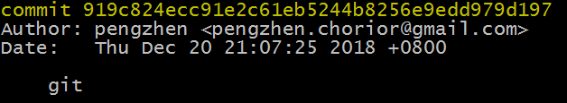

# git 工作流

## 本文结构

*	[版本管理](#version_control)
*	[git 安装](#git_install)
*	[git 配置](#git_config)
*	[创建仓库](#create_repository)
*	[管理类型](#gitignore)
*	[基本流程](#basic_process)
*	[基本操作](#basic_operation)
*	[分支操作](#branch_operation)
*	[远程仓库](#remote_repository)
*	[常用操作](#common_operation)

<h2 id="version_control">版本管理</h2>

**版本控制是一种记录若干文件内容变化，以便将来查阅特定版本修订情况的系统**。

最开始的版本管理系统是 CVCS(Centralized Version Control Systems)，即集中式版本管理系统，该系统将所有版本的历史记录保存在单一的位置，类似于我们常说的备份，这种版本管理最大的缺点就是：**一旦保存记录的磁盘发生损坏，就可能丢失所有历史更新信息**。

后来 linus 大神团队花两三个月开发了 git，其系统为 DVCS(Distributed Version Control System)，即分布式管理系统，该系统不只提取最新版本的文件快照，而且把原始的代码仓库都完整地镜像下来，这意味着**只要有一个镜像没有损坏，那么所有的历史记录都能完整的恢复出来**。

git 除了具有 DVCS 的特点外，还有相当多的优点：

*	git 只关心文件数据的整体是否发生变化，而大多数其他系统则只关心文件内容的具体差异；
*	git 中的绝大多数操作都只需要访问本地文件和资源，不用连网；
*	git 使用 SHA-1 算法计算数据的校验和，通过对文件的内容或目录的结构计算出一个 SHA-1 哈希值作为指纹字符串，所有保存在 git 数据库中的东西都是用此哈希值来作索引的，而不是靠文件名。

<h2 id="git_install">git 安装</h2>

### linux

*	Fedora: `sudo yum install git-core`
*	Debian: `sudo apt-get install git-core`

### Windows

*	<https://git-for-windows.github.io/>

<h2 id="git_config">git 配置</h2>

### 配置个人用户名和电子邮件

```bash
$ git config --global user.name pengzhen
$ git config --global user.email pengzhen@example.com
```

### 配置文本编辑器（可选）

git 在需要你输入一些信息的时候,会调用一个文本编译器，如果不设置的话，可能默认调用 nano 编辑器(linux)，一般使用 vi 或者 vim 会比较方便，所以配置编辑器为 vim：

```bash
$ git config --global core.editor vim
```

### 配置自动换行符转换（可选）

如果你在 windows 上修改 linux 上使用的文件，那么需要将 windows 的 CRLF 转换为 LF：

```bash
$ git config --global core.autocrlf input
```

### 查看配置信息

```bash
$ git config -l
```

### 提示

**如果忘记配置的话，git 不会让你提交任何东西**。仔细看，你会发现上面所有的配置都包含有 `--global` 选项，这表明所有的配置都是全局的，以后你再新建项目时，就不用再重新配置了，当然你也可以不用该选项。

另外，添加 `--global` 选项修改的是用户目录下的 `.gitconfig` 文件，例如 windows 下我的就是 `C:\Users\pengzhen\.gitconfig`，linux 下为 `~/.gitconfig`；不添加 `--global` 选项修改的是项目目录下的 `.git/config`，**该配置文件的变量会覆盖全局的同名变量**。

<h2 id="create_repository">创建仓库</h2>

**仓库分为远程仓库和本地仓库**，我们一般在本地仓库上进行修改，然后再将本地仓库合并到远程仓库。

有两种创建本地仓库的方法：

在现存目录下，通过初始化创建新的 git 仓库，结束之后会在当前目录下生成一个 `.git` 隐藏目录：

```bash
$ cd dir
$ git init
```

克隆 github 上 git 组织开源的 git 仓库到本地仓库 mygit：

```bash
$ git clone git://github.com/git/git.git mygit
```

**所有 git 需要的数据和资源都存放在 `.git` 目录下**。

<h2 id="gitignore">管理类型</h2>

有时候仓库里有一些不必要加入版本管理的文件，如代码编译生成的中间文件，这时候就需要控制管理文件的类型了。

git 使用工作目录下一个名为 `.gitignore` 的文件来忽略掉一些不想被 git 管理的文件，该文件是不会自动生成的，需要你自己创建。

`.gitignore` 文件支持正则表达式：

*   以井号“#”开头代表注释；
*   以斜杠“/”结尾表示目录；
*   以星号“*”通配多个字符；
*   以问号“?”通配单个字符；
*   以方括号“[]”包含单个字符的匹配列表；
*   以叹号“!”表示不忽略匹配到的文件或目录。

举个简单的例子：

```bash
.[oa]      # 忽略所有后缀为 .o 或者 .a 的文件
[Dd]ebug/  # 忽略 Debug 或 debug 目录
```

<h2 id="basic_process">基本流程</h2>

**任何一个文件，在 git 中都只有三种状态**：

*	已提交(committed)：该文件已经被安全地保存在本地数据库中；
*	已修改(modified)：修改了某个文件，但还没有提交保存；
*	已暂存(staged)：把已修改的文件放在下次提交时要保存的清单中。

Git 管理项目时，文件会流转三个区域：

*	本地数据库：保存元数据和对象数据库的地方，即 `.git` 目录；
*	工作目录：从项目中取出某个版本的所有文件和目录，用以开始后续工作，即 `.git` 所在的目录；
*	暂存区域：顾名思义，暂时存放修改文件的地方；

所以管理 git 的基本流程就是：

*	在工作目录中修改某些文件；
*	对这些修改了的文件作快照，并保存到暂存区域；
*	提交更新，将保存在暂存区域的文件快照转储到本地数据库。

<h2 id="basic_operation">基本操作</h2>

```bash
$ git status                  # 查看当前文件的状态
$ git add file                # 添加 file 到暂存区域
$ git add .                   # 添加当前目录下的所有修改到暂存区域
$ git reset file              # 移除暂存区域内的 file
$ git reset                   # 移除暂存区域内的所有文件
$ git diff                    # 查看暂存区域文件与工作目录文件的差异
                              # 若无暂存则为当前版本数据库文件与工作目录文件的差异
$ git diff --staged           # 查看暂存区域文件与当前版本数据库文件的差异
$ git checkout -- file        # 取消对 file 的修改
$ git commit -m "1.0"         # 将暂存区域内的文件提交到数据库，提交说明为 1.0
$ git commit --amend -m "1.0" # 撤销上次的提交并重新开始新的提交
$ git log                     # 查看提交历史
```

关于提交历史：

*   第一行为对应提交的 SHA-1 校验和；
*   第二行为作者姓名和邮件地址；
*   第三行为提交时间；
*   第四行缩进一个段落显示提交说明。



<h2 id="branch_operation">分支操作</h2>

有时候一个功能可以使用多种方法进行实现，可能需要对各种方法进行性能评估，这时候就可以在当前版本的基础上建立多个分支，用以不同的实现方式。

```bash
$ git branch -a                        # 查看所有分支列表
$ git branch [branch_name]             # 建立当前版本的一个新分支 branch_name
$ git checkout [branch_name]           # 切换到 branch_name 分支
$ git checkout -b [branch_name]        # 新建并切换到 branch_name 分支
$ git log                              # 查看提交历史 SHA-1 校验和
$ git checkout SHA-1 -b [branch_name]  # 为校验和为 SHA-1 的历史版本建立一个新分支 branch_name
                                       # SHA-1 不必写全，只要唯一即可，一般写6位
$ git branch -d [branch_name]          # 删除 branch_name 分支
$ git branch -D [branch_name]          # 强制删除 branch_name 分支
$ git merge [branch_name]              # 将 branch_name 分支合并到当前分支
```

<h2 id="remote_repository">远程仓库</h2>

当本地仓库修改完之后，可能需要合并到远程仓库：

```bash
$ git remote -v                       # 查看远程分支列表
$ git remote add [shortname] [url]    # 添加远程仓库，远程仓库名为 shortname，地址为 url
$ git remote rm [shortname]           # 删除名为 shortname 的远程仓库
$ git remote rename [old] [new]       # 修改远程仓库 old 的名字为 new
$ git fetch [shortname] [branch_name] # 抓取远程仓库 shortname 的 branch_name 分支到本地数据库，checkout 切换到该分支
$ git pull [shortname] [branch_name]  # 抓取远程仓库 shortname 的 branch_name 数据并合并到当前分支
$ git push [shortname] HEAD           # 推送当前分支到远程仓库 shortname 的同名分支
```

<h2 id="common_operation">常用操作</h2>

生成 ssh 公匙：

```bash
$ ssh-keygen -t rsa -C pengzhen@example.com # 后面一直回车即可
$ cat /c/Users/pengzhen/.ssh/id_rsa.pub     # 查看生成的密匙
```

回退版本：

```bash
$ git log                                    # 查看要回退的版本 SHA-1
$ git reset --hard [SHA-1]                   # 回退到 SHA-1
$ git reset --hard HEAD~[num]                # 回退到当前提交前的第 num 个提交
$ git push [shortname] [branch_name] --force # 强制推送到远端
```

清理当前目录下的所有修改和临时文件：

```bash
$ git reset         # 移除暂存区域内的所有文件
$ git clean -dfx    # 删除当前目录下所有未被 git 跟踪的文件或文件夹
$ git checkout -- . # 移除当前目录下所有文件的修改
```

查询提交信息（下面的选项可以合并使用）：

```bash
$ git log --author=pengzhen  # 查询特定作者的提交记录
$ git log --oneline          # 显示提交记录时，只显示一行
$ git log --name-only        # 查询提交记录时，同时显示修改的文件列表
```

查询一个文件的某个改动：

```bash
$ git blame -L [start],[end] [filename]  # 查看 filename 从 start 到 end 行的最近的修改记录
$ git log -L [start],[end]:[filename] # 查看 filename 从 start 到 end 行的所有修改记录
$ git log -S "[string]" [filename]       # 查看 string 被添加到 filename 的记录
```

取消当前修改，但是后面又想做一样的修改：

```bash
$ git stash        # 将当前修改储藏起来，并返回到原来未修改的状态
$ git stash list   # 查看储藏列表
$ git stash pop    # 应用最近的储藏，并删除堆栈
$ git stash clear  # 删除所有储藏
```

将其它分支的一个或多个commit合并到本分支：

```bash
$ git cherry-pick [commit_id]                         # 合并单个 commit 到本分支
$ git cherry-pick [commit_id1] [commit_id2]           # 合并多个 commit 到本分支
$ git cherry-pick [commit_id_start]..[commit_id_end]  # 合并连续的 commit 到本分支，前开后闭
```

其它：

* [git revert](https://www.cnblogs.com/0616--ataozhijia/p/3709917.html)

* [git rebase](https://www.yiibai.com/git/git_rebase.html)

* [git review](https://blog.csdn.net/aixiaoyang168/article/details/77179008)